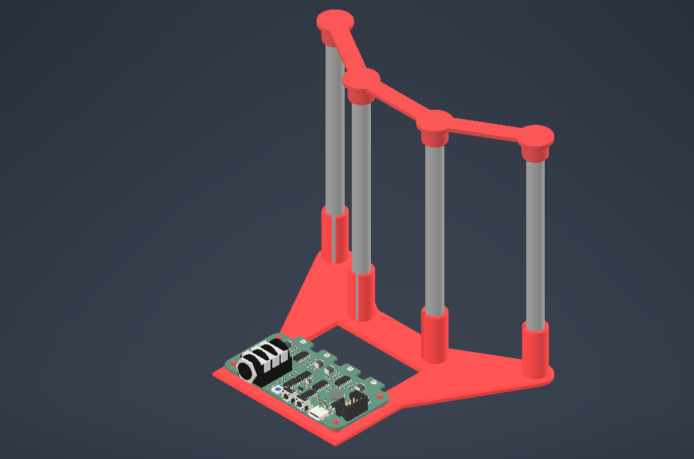
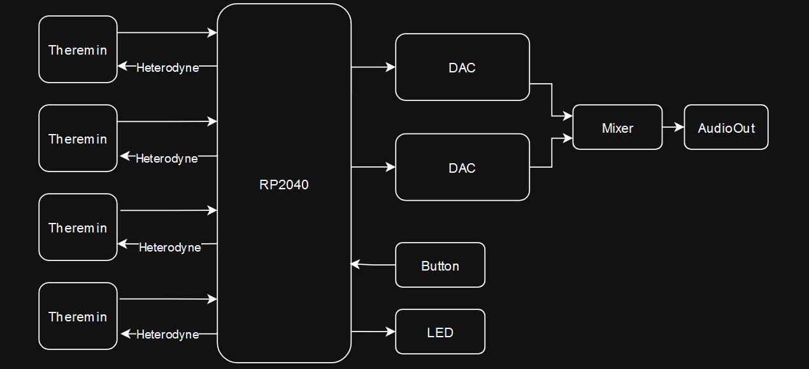

# PolyTheremin Test Platform  
More details are available in the [PolyTheremin repository](https://github.com/MiCyg/PolyTheremin) (currently under development).

# Description  

This test platform features a main board with four capacitive proximity sensors based on [OpenTheremin](https://github.com/GaudiLabs/OpenThereminV4) electronics.  

The key improvement in this version is the replacement of the fixed-frequency oscillator with a microcontroller-driven heterodyne frequency generator. This modification simplifies the circuit design and calibration process.  

The platform enables the analysis of antenna correlation errors, visualized on an XY plot.  
Its ultimate goal is to provide a functional example of a PolyTheremin with four independent oscillators, significantly reducing finger cross-correlation.

# PCB Characteristics  
- **Microcontroller**: RP2040  
- **LED**: One addressable LED for status indication  
- **Oscillator Modules**: Four theremin modules, independently connected to the microcontroller  
- **Audio Output**: Four 12-bit DACs (MCP4922) with a mixer and a 6.3mm jack socket  

# Block Schematic  

# 3D View  

# Contribution  

Contributions are welcome!  
If you have suggestions, encounter any issues, or want to discuss the project, feel free to contact me or open a pull request.  
